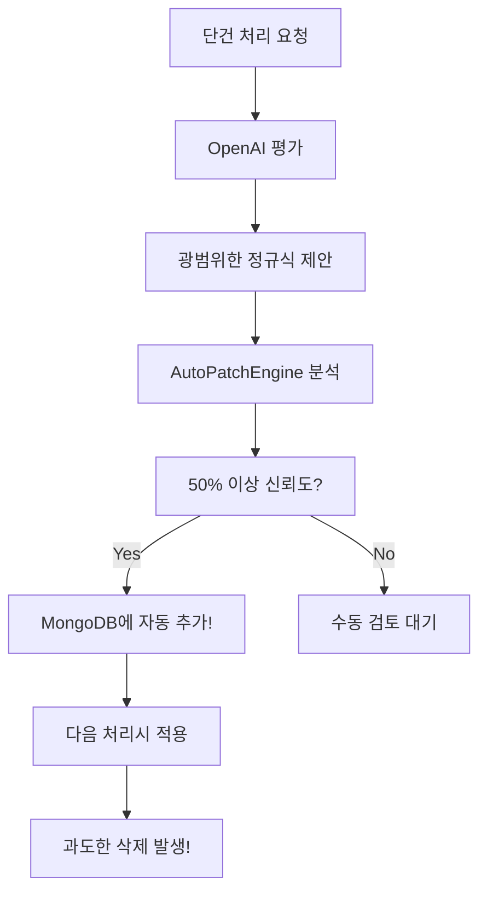

# 🚨 광범위한 정규식 생성 문제 분석

## 🔍 **문제의 근본 원인 발견**

### **핵심 문제: OpenAI 프롬프트가 광범위한 정규식을 직접 유도**

#### **📁 파일**: `app/services/openai_service.py` (146-248번 줄)

### **🚨 문제가 되는 프롬프트 내용들:**

#### **1. 과도하게 공격적인 목표 (174-175번 줄):**
```python
"- **사실관계만 남기고 나머지는 모두 노이즈로 제거하는 패턴을 제안하세요**"
"- **목표: 순수한 사실관계만 추출하여 2단계 처리에 전달**"
```
☠️ **결과**: AI가 "모든 것을 제거"하라는 지시로 인해 과도하게 공격적인 패턴 생성

#### **2. 광범위한 정규식을 직접 예시로 제공 (225-235번 줄):**
```python
"pattern_before": "따라서.*?판단한다|그러므로.*?인정된다|결론적으로.*?본다"  # ❌ 위험!
"pattern_before": "법리상.*?해석|법적으로.*?판단|이 법원은.*?본다"        # ❌ 위험!
```
☠️ **결과**: AI가 이런 광범위한 패턴을 "좋은 예시"로 학습하여 계속 생성

#### **3. 자동 적용 임계값이 너무 낮음:**
```python
# app/api/endpoints.py 176번 줄
auto_apply_threshold=0.5  # 50% 신뢰도면 바로 자동 적용!
```
☠️ **결과**: 위험한 규칙도 50% 신뢰도만 있으면 자동으로 MongoDB에 추가됨

### **🔄 자동 생성 → 적용 프로세스:**



### **📊 실제 생성된 위험한 규칙들:**

#### **극도로 위험한 규칙:**
```json
{
  "pattern": "【.*?】",  // 모든 대괄호 섹션 삭제!
  "priority": 40,
  "auto_applied": true
}
```

#### **매우 위험한 규칙들:**
```json
{
  "pattern": "【변론종결】.*?【주 문】",  // 중간 모든 내용 삭제
  "priority": 80,
  "auto_applied": true
},
{
  "pattern": "법리상.*?해석|법적으로.*?판단",  // 사실관계 포함 삭제
  "priority": 93,
  "auto_applied": true
}
```

## ✅ **해결 방안**

### **1. 프롬프트 수정 (즉시)**
- ❌ "모든 것을 제거" → ✅ "확실한 노이즈만 제거"
- ❌ 광범위한 예시 → ✅ 구체적이고 안전한 예시
- ❌ `.*?` 패턴 → ✅ `^패턴$` 라인 단위 매칭

### **2. 자동 적용 임계값 상향 (즉시)**
```python
# 기존 (위험)
auto_apply_threshold=0.5  # 50%

# 수정 (안전)
auto_apply_threshold=0.9  # 90% 이상만 자동 적용
```

### **3. 규칙 검증 로직 추가**
```python
def is_safe_pattern(pattern: str) -> bool:
    """위험한 패턴 검증"""
    dangerous_patterns = [
        r"【.*?】",  # 모든 대괄호
        r".*?판단한다",  # 광범위한 판단
        r".*?해석",  # 광범위한 해석
    ]
    return not any(re.search(dp, pattern) for dp in dangerous_patterns)
```

### **4. 기존 위험한 규칙 비활성화**
```python
# MongoDB에서 즉시 비활성화해야 할 규칙들
dangerous_rule_patterns = [
    "【.*?】",
    "【변론종결】.*?【주 문】",
    "법리상.*?해석",
    "따라서.*?판단한다"
]
```

## 🎯 **즉시 조치 사항**

1. **프롬프트 수정**: `app/services/openai_service.py` 174-235번 줄
2. **임계값 상향**: `app/api/endpoints.py` 176번 줄 (0.5 → 0.9)
3. **위험한 규칙 비활성화**: MongoDB에서 즉시 `enabled: false`
4. **검증 로직 추가**: 새로운 규칙 추가 전 안전성 검증

**이 수정으로 더 이상 광범위하고 위험한 정규식이 자동 생성되지 않을 것입니다!** 🎉
